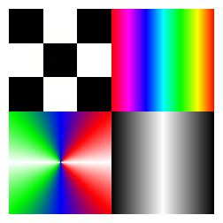
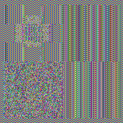

# CWE-327
Difficulty: Hard

### 1. What's in the provided file?
Analyse the provided `.eml` file. It is some correspondence between the instructors. We can quickly notice a couple of things:
   - there are plenty of `.bmp` files in the attachments
   - the attachments are encrypted using AES
   - there is a reference to scripts used during the classes (I included them in the `decrypt` directory)

### 2. Attachments
Extract the attachments and analyse them. For this purpose, we can use the functions available in `email` module. As a result we should receive the following files:
- `010101_RGB_48x20px_ECB_encrypted.bmp`
- `020202_RGB_48x20px_ECB_encrypted.bmp`
- `030303_RGB_48x20px_ECB_encrypted.bmp`
- `040404_RGB_48x20px_ECB_encrypted.bmp`
- `050505_RGB_48x20px_ECB_encrypted.bmp`
- `barcode_RGB_280x558px_ECB_encrypted.bmp`
- `FAFAFA_RGB_48x20px_ECB_encrypted.bmp`
- `FBFBFB_RGB_48x20px_ECB_encrypted.bmp`
- `FCFCFC_RGB_48x20px_ECB_encrypted.bmp`
- `FDFDFD_RGB_48x20px_ECB_encrypted.bmp`
- `FEFEFE_RGB_48x20px_ECB_encrypted.bmp`

### 3. BMP files are very specific
Learn about the `.bmp` files:
   - they contain a specific header
   - the header is followed by the image data

You can find more information about the BMP file format here: \
http://www.ue.eti.pg.gda.pl/fpgalab/zadania.spartan3/zad_vga_struktura_pliku_bmp_en.html

### 4. Names contain a lot of information
Analyse the name of each exported image. Here's a short example `010101_RGB_48x20px_ECB_encrypted.bmp`
   - `010101` - the colour in hexadecimal
   - `RGB` - the colour space
   - `48x20px` - the resolution of the image
   - `ECB_encrypted` - the AES encryption mode is ECB

The `barcode` file is obviously the one that we're interested in. It's the only one that has a different resolution, and it's also the only one that has a different name. It's likely that it contains the flag.

### 5. ECB is a weak encryption mode
It encrypts each block of data independently. This means that the same block of data will be encrypted to the same ciphertext. Other than that, we can often obtain a lot of information even without fully decrypting the data. Here's an example: \
     \
_The image on the left is the original one, and the image on the right is the encrypted one._

### 6. Replacing encrypted chunks with decrypted ones
Since BMP files normally aren't encrypted on its own, nor compressed, the pixel data is stored in a straightforward way. We can use this to our advantage. For example, we can compare the pixel data of the encrypted image with the original one. If the pixel data block is the same as in one of the single colour images that we received from the attachments, we can safely replace it with the actual colour.

### 7. Python implementation
After using this entire knowledge, we can construct a final Python program that will do the task of decryption for us. While my execution likely isn't the perfect one, it's still enough to read the flag from the output image. You can check my code in `bmp_utils.py` and `main.py` files.

### 8. Result
**Image:** `result_final.bmp` \
**Barcode:** `363e0ab511b87c7a` \
**Flag:** `PW{363e0ab511b87c7a}`